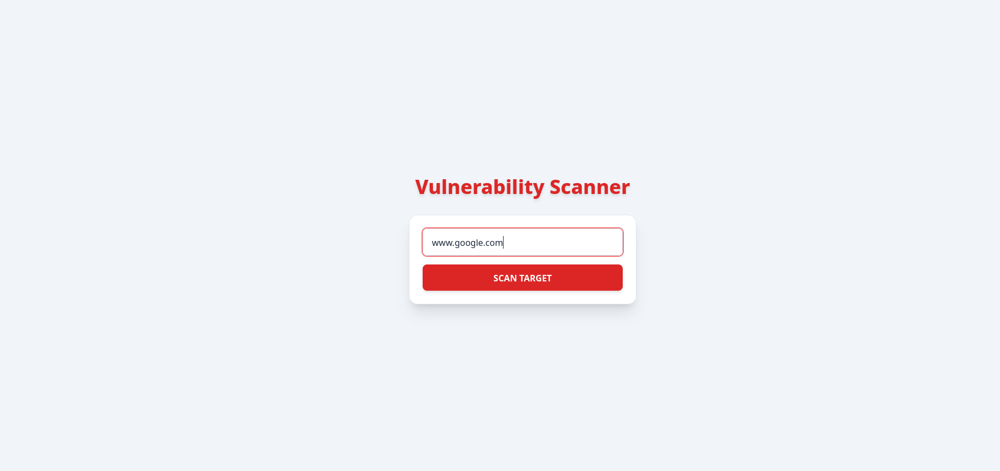
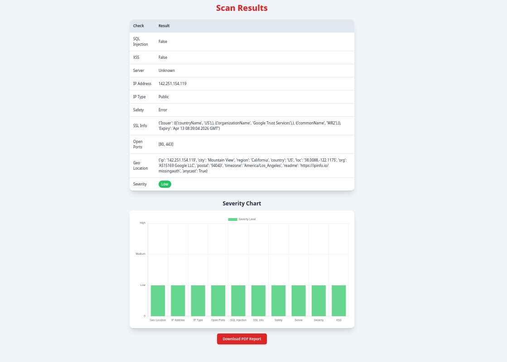

# ⚠️ Vulnerability Scanner (Web App)

A simple web-based Vulnerability Scanner that analyzes a target URL and generates a clean security report with severity levels and charts.

---

## 🖥️ Preview





---

## ✨ Features

* Scan a target URL for vulnerabilities
* Clean light-theme interface
* Severity levels (High / Medium / Low)
* Visual severity chart
* PDF report download
* Responsive design (mobile + desktop)
* Loading indicator during scan

---

## 🛠️ Built With

* Python (Flask)
* HTML + Tailwind CSS
* Chart.js
* Jinja2 Templates

---

## ▶️ Installation

### 1️⃣ Clone or Download the Project

```
git clone https://github.com/udayraut128/vulerability_scanner.git
cd vulnerability-scanner
```

---

### 2️⃣ Create Virtual Environment (Recommended)

```
python -m venv venv
```

Activate:

**Windows**

```
venv\Scripts\activate
```

**Linux / macOS**

```
source venv/bin/activate
```

---

### 3️⃣ Install Dependencies

Install all required packages using the requirements file:

```
pip install -r requirements.txt
```

---

### 4️⃣ Run the Application

```
python app.py
```

---

### 5️⃣ Open in Browser

```
http://127.0.0.1:5000
```

---

## 📁 Project Structure

```
vulnerability-scanner/
│
├── app.py
├── requirements.txt
├── scanner/
├── templates/
│   ├── index.html
│   └── report.html
│
├── assets/
│   ├── image1.png
│   └── image2.png
│
├── venv/
└── README.md
```

---

## 🎯 Purpose

This project is designed for:

* Cyber Security students
* Final year projects
* Learning web security concepts
* Demonstrating vulnerability scanning basics

---

## ⚠️ Disclaimer

This tool is for educational and ethical purposes only.
Do not scan systems without proper authorization.

---

**Made with ❤️ for Cyber Security Learning**
